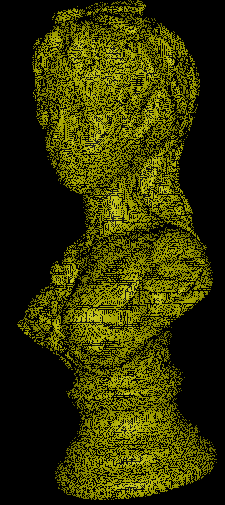
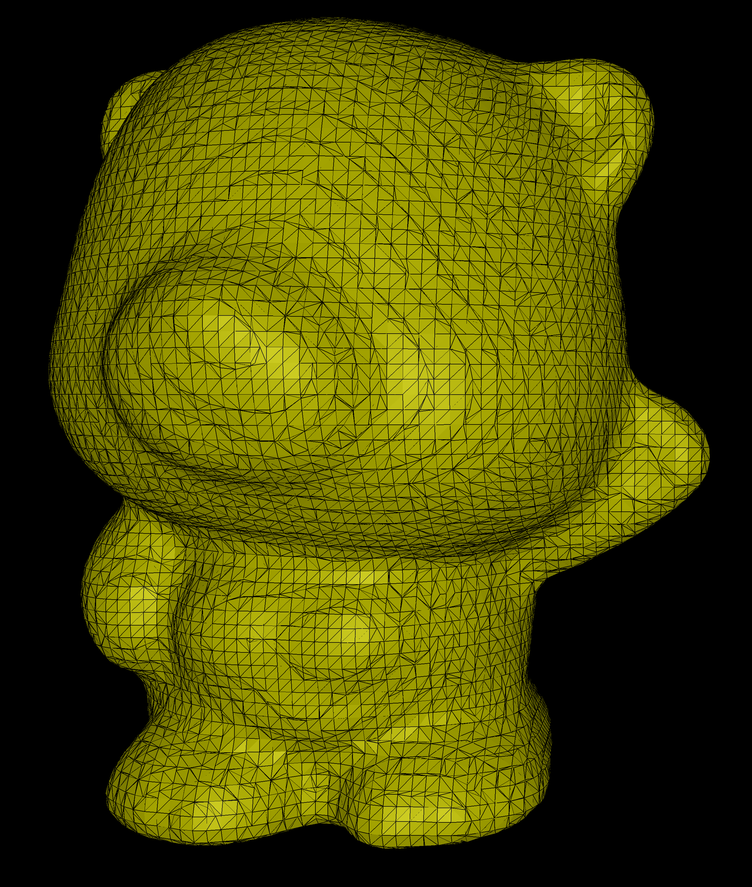

[](https://github.com/ForesightMiningSoftwareCorporation/PoissonReconstruction/actions/workflows/release.yml) 
# PoissonReconstruction
This is a Rust implementation of the Screened Poisson Reconstruction surface reconstruction algorithm. This
implementation comes courtesy of Foresight Mining Software Corporation who sponsor its creation and maintenance.

## Reference papers
- [Poisson Surface Reconstruction](https://hhoppe.com/poissonrecon.pdf) by Kazhdan, Bolitho, and Hoppe.
- [Screened Poisson Surface Reconstruction](https://www.cs.jhu.edu/~misha/MyPapers/ToG13.pdf) by Kazhdan and Hoppe.

## Features
Given a set of points and normals, the `PoissonReconstruction` will generate an implicit function from which the
reconstructed surface can be extracted.

```rust
let poisson = PoissonReconstruction::from_points_and_normals(
    &points, &normals, 0.0, 4, 5, 10
);
let mesh_vertices = poisson.reconstruct_mesh();
```

The `PoissonReconstruction` representing an implicit function, it can be evaluated at space locations with
`PoissonReconstruction::eval`. For convenience, a very basic isosurface extraction based on marching-cubes is provided
with `PoissonReconstruction::reconstruct_mesh()`.

## Limitations
Some speed optimizations described in the Kazhdan et al. paper. Namely, it currently doesn’t implement the
hierarchical clustering of point optimization nor the conforming version of the castadic solver.

## License

PoissonReconstruction is free and open source! All code in this repository is dual-licensed under either:

* MIT License ([LICENSE-MIT](LICENSE-MIT) or [http://opensource.org/licenses/MIT](http://opensource.org/licenses/MIT))
* Apache License, Version 2.0 ([LICENSE-APACHE](LICENSE-APACHE) or [http://www.apache.org/licenses/LICENSE-2.0](http://www.apache.org/licenses/LICENSE-2.0))

at your option. This means you can select the license you prefer! This dual-licensing approach is the de-facto standard
in the Rust ecosystem and there are very good reasons to include both.

Unless you explicitly state otherwise, any contribution intentionally submitted for inclusion in the work by you, as
defined in the Apache-2.0 license, shall be dual licensed as above, without any additional terms or conditions.

## Sponsors
The creation and maintenance of PoissonReconstruction is sponsored by Foresight Mining Software Corporation.


## Samples




