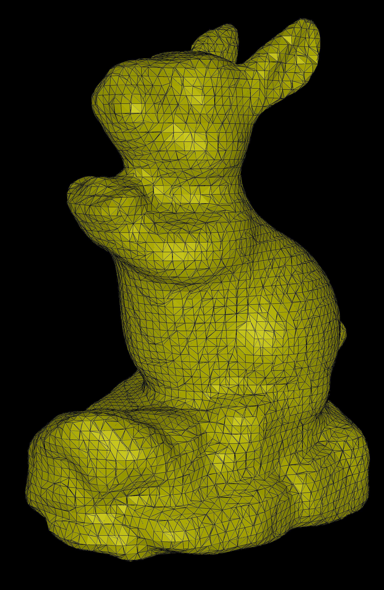

[](https://github.com/ForesightMiningSoftwareCorporation/PoissonReconstruction/actions/workflows/release.yml) 
# PoissonReconstruction
This is a Rust implementation of the [Screened poisson reconstruction](https://www.cs.jhu.edu/~misha/MyPapers/ToG13.pdf)
by Kazhdan and Hoppe.

## Features
Given a set of points and normals, the `PoissonReconstruction` will generate an implicit function from which the
reconstructed surface can be extracted.

```rust
let poisson = PoissonReconstruction::from_points_and_normals(
    &points, &normals, 0.0, 4, 5, 10
);
let mesh_vertices = poisson.reconstruct_mesh();
```

The `PoissonReconstruction` representing an implicit function, it can be evaluated at space locations with
`PoissonReconstruction::eval`. For convenience, a very basic isosurface extraction based on marching-cubes is provided
with `PoissonReconstruction::reconstruct_mesh()`.

## Limitations
Some of the speed optimizations described in the Kazhdan et al. paper. Namely, it currently doesn’t implement the
hierarchical clustering of point optimization nor the conforming version of the castadic solver.

## Samples





